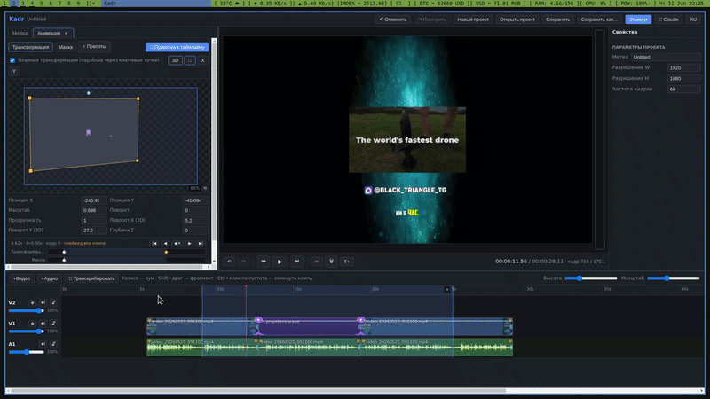

# Kadr

**AI-native, GPU-accelerated video editor — with Claude Code built into the timeline.**

[Русская версия →](README.md) · [Full feature guide (RU) →](FEATURES.md) · [Video →](https://www.youtube.com/watch?v=1RKRtRgzE24)

[](LICENSE)



Kadr is a multi-track video editor (Electron + React + TypeScript) built
around one idea: *an AI agent should be able to edit video next to you, on
the same timeline, with the same tools.* Press “Claude”, type “add animated
captions to this part”, watch it happen live in the preview.

## Highlights

- 🎬 **Real multi-track editing** — video/audio/text tracks, trimming,
  looping, fades, linked AV clips, ripple delete, full undo history.
  Clip speed from ×0.02 to ×100 by Ctrl-dragging **either** clip edge
  (the left one anchors the right boundary), snapping to round
  multipliers and to neighbouring clips' edges, with a live ×N badge.
- 📥 **Media from anywhere** — drop files onto any spot of the window
  (onto a track they land as clips back-to-back at the drop point, audio
  routes to an audio track), drag a picture straight out of a browser
  (fetched by URL), or hit Ctrl+V — clipboard paste understands both
  copied files and "Copy image" (e.g. from Telegram, which won't let
  photos be dragged out at all). XDG-portal drags from sandboxed apps
  are supported too. The media bin gets multi-select and deletion that
  removes the files together with their timeline clips (single undo).
- ⚡ **GPU compositing (WebGL2)** — the preview *is* the render: the same
  compositor draws both, so export is pixel-exact WYSIWYG.
- 🔑 **Keyframes everywhere** — position, scale, rotation, opacity, volume,
  masks; AE-style workflow with easing.
- 🧊 **True 3D** — per-clip tilt/depth and whole-track camera motion with
  perspective-correct texturing.
- 🎭 **Masks** — animatable edge crop plus up to 8 feathered shapes
  (rect/ellipse/triangle, invertible).
- 🌫️ **Effects: smoky outer glow and blur** — a glow of billow-noise
  smoke, ragged tendrils and drifting embers, plus per-layer gaussian
  blur with an intensity slider; fully parametric, preset-able,
  identical in preview and export.
- ⏪ **Clip reverse** — right-click → “Reverse”: the used source range is
  rendered backwards (cached), the linked AV pair flips in sync, and a
  second click instantly restores the original.
- 🔀 **26 transitions** — 14 overlap transitions (Vegas-style: just overlap
  two clips) and 12 cinematic edge transitions (whip pans, blur zooms, RGB
  split, glitch…) with spectral motion blur.
- 🗣️ **Local speech-to-text** — faster-whisper (large-v3) with word-level
  timestamps and serious anti-hallucination guards (a pure tone yields
  *zero* cues — enforced by tests). SRT/TXT editing built in.
- ✨ **Auto-captions** — one dialog: transcribe → animated karaoke captions
  (word-precise highlight, pop/rise/fade entrances), drag & scale them with
  the mouse right in the preview.
- 🌊 **Neon wave** — an audio-reactive glowing line driven by the loudness
  of the selected range (whole mix or a single track); restyle it in the
  fragment's code, the envelope matches Blender's "Bake Sound" exactly.
- 🥁 **Cutting to the music** — «Биты» (Beats) finds the beats of any sound
  on the timeline (a port of librosa's `beat_track`, beat for beat) and lays
  them down as thin marks that clips, edges and the playhead snap to. Where
  librosa is systematically late — on a brickwalled track with an 808 it is
  ~110 ms, six visible frames — the grid moves itself onto the real attacks.
  Remotion fragments **hear the music**: the sound under a clip is baked
  into its folder (level, bass, mid, treble, beat pulses), so letters and
  light jump exactly on the bass, and a moved edit is re-baked before export.
- 🔊 **Sound and music library** — 260 effects (CC0) and five music beds
  (CC BY 4.0) right in the editor, plus your own sound folder. Every sound is
  labelled (brightness, harshness, envelope) and knows the moment of its
  **hit**, so an effect lands on the beat with its impact, not with its file
  start — a boom with a lead-in can hit a second and a half in. Licences are
  in [resources/CREDITS.md](resources/CREDITS.md).
- 🗣️ **ElevenLabs voice-over** — any text (from the media bin, a file on
  disk, or typed into the dialog) becomes an audio clip on the timeline.
  Long text is cut at sentence boundaries under the model's limit and
  stitched with `previous_text`/`next_text`, so the intonation does not
  break at the seams; the optional speed-up is applied in the same ffmpeg
  pass as the decode, costing no extra generation. Output is FLAC and
  keeps the channel count the synthesis returned (mono stays mono —
  upmixing to stereo quietly cost 3 dB). **The API key never reaches the
  renderer** and never enters the project file: it lives in `<userData>`
  with mode 0600, and the page can only ask whether one is set.
- 🎯 **Voice-over defect detection and single-phrase regeneration** — a
  local detector (the author's own project, vendored into the editor)
  marks suspicious spots on the timeline as violet bands: left-click for
  "defect", right-click for "not a defect", double-click to hear the
  phrase. Confirmed spots are **regenerated together in one pass**: the
  new take is synthesised from the exact script substring with its
  surrounding context, matched in tempo and level, and spliced with an
  equal-power crossfade in the middle of the real silence between
  sentences. The new length is measured, never computed, and everything
  to the right shifts on every track, so picture and sound stay in sync.
  Your verdicts accumulate and retrain the detector on request.
- 🪟 **Preview in a window of its own** — the button next to the frame
  snapshot detaches the preview into a real OS window: resize it, move it
  to a second monitor, watch it full-screen while the timeline stays in
  the main window. The very same canvas moves across — no GPU context is
  rebuilt, no fragment reloads, and Space and the arrows drive the
  transport from either window. A second click brings it back.
- 🎨 **A real design system** — one token palette, icons instead of emoji
  (every OS ships its own emoji font, and they never lined up with the
  text beside them), contrast measured against WCAG 2.2 AA, a visible
  keyboard focus ring, one shell behind every dialog (Escape, a focus
  trap, and editor shortcuts that no longer fire through an open dialog),
  and a timeline scrollbar you can actually grab — with a minimum thumb
  size, because at high zoom on a 15-minute project it used to degenerate
  into a single pixel.
- 🧰 **Session log and storage panel** — two unobtrusive topbar buttons.
  The log says what actually failed (twenty places used to report only to
  the console), lives in memory only and dies with the window. Storage
  shows what the editor has left on disk and splits it into rebuildable
  (proxies, decoded intermediates, fragment renders — cleanable by type
  and by project) and referenced (reversed clips, downloads, voice-overs),
  which is never offered up to a cheerful one-click delete. Wipe the
  proxies, open the project a year later — it picks them back up.
- ⚛️ **Remotion fragments** — programmable React/TSX motion graphics as
  timeline clips. Live preview with hot reload (no renders while
  iterating!), automatic pixel-capture mode when you put GL effects, 3D or
  transitions on a fragment, and exactly **one** real render at export
  (content-hash cached). Fragment sources live **in the project folder**,
  so a project travels with its graphics. A fragment render reports both of
  its phases (frames and encoding) and really stops on Cancel, with its
  whole process tree.
- 🪟 **Alpha video** — transparent WebM (VP8/VP9+alpha), MOV (ProRes 4444)
  and HEVC with alpha keep their transparency in both preview and export:
  lower tracks show through, masks and effects behave as usual.
- 🤖 **Embedded Claude Code** — a real interactive Claude session in a
  terminal panel, wired to the live project over MCP: it reads the
  timeline, edits clips, transcribes, creates and iterates Remotion
  fragments while you watch the preview update. The panel is draggable,
  resizable and remembers its place across launches.
- 📍 **Timeline markers** — press **M** to drop a numbered marker at the
  playhead: drag it, right-click to remove it, it lives in the project
  file and the embedded Claude can see and place them too ("retime
  everything between marker 3 and marker 4").
- 📤 **Uncompromised export** — video is encoded by ffmpeg x264 at the
  preset's true bitrate (Chromium's built-in encoder ignored the bitrate
  and softened the picture — measured and replaced; frames reach ffmpeg
  with zero copies), 8-sample motion blur, automatic frame blending for
  fps-mismatched sources, presets for YouTube/Shorts/WebM/MP3, a master
  limiter at −1 dBFS on the mix (a loud track under a hit no longer clips —
  it measured +9.8 dBFS; everything below the limit passes bit for bit), and
  a short chime when the render is done.
- 🚀 **Fast on every source** — seeking a `<video>` element costs ~0.2 s
  per frame, so the exporter avoids it everywhere: alpha video (every
  transparent Remotion fragment included) is read through a **lossless**
  colour-over-matte intermediate, MP4s with the index at the end of the
  file are picked up from their tail, undecodable codecs go through an
  H.264 intermediate. A real 11-minute project full of transparent
  fragments now exports in **13 minutes instead of hours** (58 fps at
  1080p60).
- 🛟 **Quality-of-life** — background 540p preview proxies, autosave every
  5 minutes (atomic, skipped during exports/AI sessions), an
  unsaved-changes indicator with “✓ Saved” feedback, self-healing after
  hard closes (no lingering processes), effect & pose presets shared
  across projects, RU/EN interface.
- 🔒 **Clean `npm audit`** — Electron 42 / Chromium 148, vite 7, fresh
  tar: 0 known vulnerabilities in the dependency tree (thanks to
  [@Antony-hash512](https://github.com/Antony-hash512) for
  [issue #1](https://github.com/HelpFreedom/kadr/issues/1)).

## Requirements

| Component | Needed for | Notes |
|---|---|---|
| Node.js ≥ 20 | everything | |
| ffmpeg + ffprobe | import, audio mix, export | any recent build in PATH |
| python3 + [faster-whisper](https://github.com/SYSTRAN/faster-whisper) | speech-to-text, auto-captions | `pip install faster-whisper`; models download on first use |
| [Claude Code CLI](https://docs.anthropic.com/en/docs/claude-code) | the “Claude” panel | optional; uses your existing login |
| network (one-time) | Remotion fragments workspace | `~/kadr-fragments`, ~150 MB |
| an [ElevenLabs](https://elevenlabs.io) key | voice-over | optional; entered in the voice-over settings and kept outside the project |
| python ≥ 3.11 with torch | voice-over defect detection | optional; the interpreter is a setting, and without it the module degrades to plain voice-over instead of breaking |

## Getting started

```bash
git clone https://github.com/HelpFreedom/kadr.git && cd kadr
npm install        # postinstall rebuilds node-pty for Electron
npm run dev
```

Import media, edit, press Export. For the AI assistant press “Claude”
in the topbar (the `claude` CLI must be installed and logged in). If your network needs a
proxy for Claude/npm, create `~/.config/kadr/claude-env.json`:

```json
{ "env": { "HTTPS_PROXY": "http://127.0.0.1:1080", "NO_PROXY": "127.0.0.1,localhost" } }
```

## NixOS

On NixOS (tested on Niri/Wayland), a plain `npm install`/`npm run dev` can
fail or render a blank window because of a few platform quirks (building
`node-pty`, no prebuilt Electron binary, Wayland/Ozone). A ready-made
`flake.nix` devShell handles this:

```bash
nix develop
npm install
npm run dev
```

See [docs/nixos.md](docs/nixos.md) for details and a non-flake fallback.

## How the AI integration works

Kadr starts a local HTTP bridge into the renderer and hands Claude an MCP
server with its own set of tools:

| Tool | What it does |
|---|---|
| `kadr_state` | full live project: tracks, clips, asset paths, transcripts, presets |
| `kadr_eval` | run JS against the editor API (every edit lands in undo history) |
| `kadr_snapshot` | render the frame to a PNG — the agent's eyes: it sees what you see |
| `kadr_export` | render the project or a range and wait for the file |
| `kadr_transcribe` | local Whisper over a file or a timeline range |
| `kadr_fragment_create` | scaffold a Remotion composition as a timeline clip |
| `kadr_neon_wave` | an audio-reactive wave over a range |
| `kadr_beats` | find the beats of a sound and place beat marks (all / every other / bars / accents) |
| `kadr_audio_react` | bake the sound under a fragment so it moves with the music |
| `kadr_sounds` · `kadr_sound_add` | find an effect or music bed in the library · place it with its hit on a beat |
| `kadr_sound_label` | describe one of your own sounds: uses, tags, a note |
| `kadr_voice_speak` | synthesise text and drop the clip on the timeline |
| `kadr_voice_check` | run the defect detector over a voice-over |
| `kadr_voice_mark` · `kadr_voice_verdict` | place your own mark · rule on a finding |
| `kadr_voice_regenerate` | regenerate the confirmed phrases (only those) |
| `kadr_voice_learn` | report the labelled corpus, and retrain only on explicit confirmation |

The killer loop: Claude creates a fragment, edits its TSX with normal file
tools, and vite hot-reloads it into your preview in ~2 seconds — you give
feedback in plain language, no rendering until the final export.

## Testing

E2E tests drive the real app over the Chrome DevTools Protocol:

```bash
npx electron-vite dev -- --remote-debugging-port=9777   # terminal 1
node scripts/e2e13.mjs                                  # terminal 2 (etc.)
```

They cover transitions, glow, presets, proxies, export fidelity
(fast-vs-fallback PSNR), motion blur, frame blending cadence, the MCP
bridge, transcription anti-hallucination, fragments and capture mode,
autosave semantics, auto-captions, the design system (contrast, no emoji,
focus, the dialog contract), the session log, the storage panel (the
"wipe the proxies, open it a year later" promise is checked in pixels),
the detached preview window, voice-over, marking and phrase
regeneration, the shape of the training corpus, beats and the sound baked
into fragments, the sound library (e2e44), fragment layering in the preview
and hot reload of project-owned fragments (e2e45).

Seven more checks run without the app and without the network:

```bash
node scripts/check-envelope.mjs   # loudness envelope (Blender's Bake Sound)
node scripts/check-ttstext.mjs    # cutting long text at real boundaries
node scripts/check-proxy.mjs      # which proxy is used, and how Chromium is told
node scripts/check-voicemap.mjs   # remapping times after a phrase is spliced in
node scripts/check-beats.mjs resources/music  # beats: librosa parity + attack alignment
node scripts/check-limiter.mjs    # the master limiter is transparent below the limit (ffmpeg)
node scripts/check-sfx-labels.mjs # sound labels against /brag's reference (ffmpeg)
```

## Documentation

- [FEATURES.md](FEATURES.md) — the full feature guide (Russian, 1900+ lines).
- [CLAUDE.md](CLAUDE.md) — architecture map (also read by Claude Code).

## Authors

- **Black Triangle** — repository owner: direction, acceptance, and all of
  the editing and audio expertise behind the features.
- **Claude** (Anthropic) — pair development: implementation, measurements,
  tests, and this documentation.

## License

[GPL-3.0](LICENSE)
